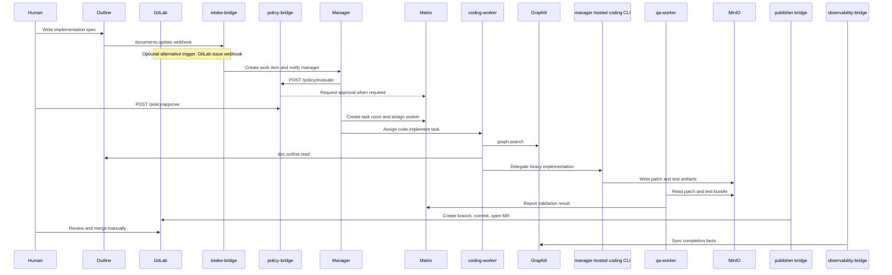

# Spec to Merge Request — Coding Workflow with Manager-Hosted CLI

This workflow covers the full loop from an implementation spec in Outline to a GitLab merge request, with human approval before execution for medium-risk work and a permanent human gate before merge.

## Overview

- **What this workflow does:** turns a spec into a normalized `code.implement` work item, gathers context, delegates heavy code editing to a manager-hosted coding CLI when needed, validates the result with `qa-worker`, and publishes a GitLab MR.
- **What stays human-gated:** approval for the run when policy requires it, and every merge to a protected branch.
- **What comes out:** a work item, task artifacts in MinIO, Matrix status updates, patch/test evidence, a GitLab branch, and an MR ready for human review.

## Prerequisites

1. **GitLab access must be available through Higress-backed tools.** The `coding-worker` should reach GitLab context through the GitLab MCP surface exposed behind Higress rather than by holding a broad PAT directly.
2. **The Manager must have a prepared workspace.** For manager-hosted CLI delegation, the Manager runtime needs the target repository cloned, the coding CLI installed, the base branch available locally, and enough disk for build or test output.
3. **A `qa-worker` role must be available.** The coding loop assumes a second worker can run `qa.run_validation` and `code.repo.review` before publication.
4. **The publisher bridge must hold GitLab publication credentials.** The actual branch creation, commit, and MR open happen inside `publisher-bridge`, which uses the configured GitLab token.
5. **Shared storage and matrix visibility must be live.** The work item directory in MinIO and the Matrix room are the durable execution record across the coding-worker, CLI, QA pass, and publish stages.

## When to Use This Workflow Instead of a Direct Developer Commit

Use this workflow when:

1. The task needs traceable approval, room-visible execution, or cross-system artifacts.
2. The change requires large-context retrieval from Outline, Graphiti, prior tasks, or linked design docs.
3. You want the AI system to produce validation evidence and a publication bundle rather than a raw patch.
4. The work may run for a while, iterate overnight, or require multiple agents.

Prefer a direct developer commit when:

1. The fix is tiny, obvious, and fully owned by a human already working in the repo.
2. There is no need for a managed approval gate or AI-generated validation bundle.
3. The change does not benefit from Outline-linked context or Graphiti recall.

## End-to-End Sequence



## Step-by-Step Walkthrough

### 1. Human writes an implementation spec in Outline

1. Create or update an Outline document with a clear implementation title.
2. Use the required sections that the intake bridge already understands:
   - `## Objective`
   - `## Acceptance Criteria`
   - `## Constraints`
3. Put these fields explicitly in the body because they are operationally important later:
   - `gitlab_project`
   - `base_branch`
   - optional `max_cost_usd`
   - optional `max_duration_sec`
4. Keep the title and body focused on implementation rather than review or documentation. If the text looks like a review request, the classifier can route it to `code.review`; if it looks like a planning or workflow document, it can route elsewhere.

Recommended spec skeleton:

```markdown
## Objective
Implement publication status reporting for the publisher bridge.

## Acceptance Criteria
- Expose a task-level publish status endpoint.
- Return published targets and external refs.
- Cover the new behavior with focused tests.

## Constraints
- gitlab_project: echothink/echothink-clawcluster
- base_branch: main
- max_cost_usd: 6.0
- max_duration_sec: 5400
- do not modify unrelated services
```

### 2. Intake bridge creates a `code.implement` work item

1. The normal Outline-driven path is `POST /webhooks/outline`.
2. A GitLab issue can also act as the trigger through `POST /webhooks/gitlab` when the issue description is treated as the source spec.
3. Unless the classifier sees another stronger signal, the intake bridge defaults unclassified work to `code.implement`.
4. The resulting work item is written to Supabase and a normalized `spec.md` is staged into MinIO.

### 3. Policy bridge checks approval before execution

1. The Manager or worker calls `POST /policy/evaluate` with work item metadata, requested cost, and room id.
2. In the current policy logic, `approval_policy=medium` auto-approves only `risk_level=low` work.
3. A typical `code.implement` task lands at `risk_level=medium`, which means the policy bridge creates an approval record and marks the request as pending.
4. Budget checks also run here. If the estimated cost, token count, or concurrency breaches policy, the task is rejected before execution.

### 4. Human approves in Matrix or through the policy bridge

1. The policy bridge writes an approval record and, when `matrix_room_id` is known, posts an approval-needed message into the room.
2. A human can approve in the room’s operational process, then the Manager calls the bridge decision route.
3. In this repo the decision route is `POST /policy/approve`; some gateway deployments expose that behind a shorter alias such as `POST /approve`.
4. Once approved, the task can move from `awaiting_approval` to active execution.

### 5. Manager assigns a `coding-worker` and stages the spec in MinIO

1. The Manager chooses or launches a `coding-worker` and associates it with the task room.
2. The task directory already contains `spec.md`; the Manager can add more execution metadata such as repo refs, linked issues, or task-run identifiers.
3. This is also the point where the Manager decides whether the task is light enough for in-container work or should be delegated to the manager-hosted CLI.

### 6. `coding-worker` uses `graph.search` to pull repo context from Graphiti

1. The worker queries Graphiti for prior decisions, implementation episodes, ownership hints, and known failure modes related to the target subsystem.
2. Good Graphiti hits often include:
   - prior MR summaries
   - architectural decisions
   - recurring defects
   - naming or API conventions
3. This reduces the chance that the coding loop repeats an already-rejected approach.

### 7. `coding-worker` uses `doc.outline.read` to pull the full spec and linked docs

1. The worker reads the original Outline doc so it is not limited to the normalized work-item excerpt.
2. It follows linked docs for architecture notes, ADRs, and acceptance details.
3. It should also extract and validate the operational constraints such as `gitlab_project`, `base_branch`, `max_cost_usd`, and `max_duration_sec` before any coding starts.

### 8. For heavy implementation, `coding-worker` delegates to the manager-hosted coding CLI

1. This follows the design’s recommended v1 pattern: the worker stays responsible for planning and iteration logic, while the Manager’s local coding CLI performs heavy repo edits.
2. The handoff should include:
   - repository path
   - base branch
   - narrowed file set if known
   - the normalized objective and acceptance criteria
   - any cost or time budget remaining
3. This model avoids giving every worker broad host-level repo access.

### 9. The CLI runs in the Manager workspace and produces patch and test output

1. The CLI edits the checked-out repo in the Manager workspace.
2. It should write a publication-friendly artifact bundle back into MinIO, for example:

```text
s3://$MINIO_HICLAW_BUCKET/hiclaw-storage/shared/tasks/task-{id}/artifacts/
  patch.diff
  test-output.txt
  gitlab-actions.json
  implementation-summary.md
```

3. `gitlab-actions.json` is especially useful because the GitLab publisher can derive commit actions directly from a JSON manifest with an `actions` list.
4. The CLI should also capture targeted test output, not just a success boolean, so QA has evidence to review.

### 10. `qa-worker` runs `qa.run_validation`

1. The QA pass checks whether the patch satisfies the acceptance criteria.
2. It re-runs or interprets targeted tests, checks for missing edge cases, and reviews whether the implementation stayed within scope.
3. The QA worker should read both the spec and the artifact bundle so it can distinguish between a true implementation failure and a missing publication artifact.

### 11. If validation fails, `coding-worker` and the CLI iterate while the Manager posts status in Matrix

1. A failed validation does not immediately fail the work item.
2. The QA worker posts a precise failure summary into the Matrix room.
3. The coding-worker turns that feedback into a narrower revision request for the CLI.
4. The Manager keeps the room updated with current attempt count, remaining budget, and whether the run is approaching timeout.

### 12. `code.repo.review` produces patch notes and a test report artifact

1. After a passing validation, the coding loop should emit a review bundle that human reviewers can consume quickly.
2. A typical bundle includes:
   - `mr-notes.md`
   - `test-report.md`
   - `implementation-summary.md`
3. This artifact set becomes the source for the MR description and for later Graphiti sync.

### 13. Publisher bridge creates the GitLab branch, commit, and merge request

1. The publish call goes to `POST /publish` with `target: "gitlab_mr"`.
2. Required metadata includes `project_id` and usually `base_branch`.
3. If `branch_name` is not provided, the publisher defaults to `clawcluster/{work_item_id}/{task_run_id}`.
4. If `mr_title` is not provided, the publisher falls back to `Publish approved output for {project_id}`.
5. The publisher creates the branch if needed, creates the commit from the artifact manifest or generated actions, then opens the MR.

### 14. A human reviewer handles the MR in GitLab

1. Merge remains human-gated, especially for protected branches.
2. The reviewer uses the MR diff, patch notes, and test report to decide whether to request changes or merge.
3. The AI system may update the branch in later iterations, but it does not bypass the GitLab review process.

### 15. On MR merge, observability records completion and `knowledge-worker` syncs code facts to Graphiti

1. After merge, the task should be closed with a completion event, including the final result summary and any merged MR references.
2. `observability-bridge` updates the `task_runs` row, syncs Langfuse metrics when a trace id exists, and requests Graphiti sync.
3. `knowledge-worker` can then convert the implementation summary, validation evidence, and MR outcome into durable code facts.
4. Future coding-workers will be able to retrieve those facts through `graph.search` instead of rediscovering them from scratch.

## Example Work Item JSON

```json
{
  "id": "wi_2b8e7f2e6f8d4692a2db5db83012a0f7",
  "workspace_id": "echothink/echothink-clawcluster",
  "kind": "code.implement",
  "source_type": "outline_document",
  "source_ref": "https://outline.example.com/doc/publisher-status-endpoint",
  "objective": "Implement task-level publish status reporting for the publisher bridge.",
  "acceptance_criteria": [
    "Expose a publish status endpoint by task run id.",
    "Return published targets, external refs, and artifact metadata.",
    "Add focused tests for the new endpoint."
  ],
  "constraints_json": {
    "gitlab_project": "echothink/echothink-clawcluster",
    "base_branch": "main",
    "max_cost_usd": 6.0,
    "max_duration_sec": 5400,
    "source_title": "Publisher status endpoint",
    "source_url": "https://outline.example.com/doc/publisher-status-endpoint",
    "linked_docs": [
      "https://outline.example.com/doc/publisher-bridge-design"
    ]
  },
  "priority": 60,
  "risk_level": "medium",
  "approval_policy": "medium",
  "requested_by": "casey.dev@example.com"
}
```

## Branch Naming Convention and MR Title Template

1. **Default branch naming convention:** `clawcluster/{work_item_id}/{task_run_id}`. This matches the publisher bridge’s fallback behavior and guarantees uniqueness per execution.
2. **Recommended MR title template:** `[ClawCluster][{work_item_id}] {objective}`. Set this through `metadata.mr_title` so reviewers see the work item id and human-readable objective immediately.
3. **Fallback MR title if omitted:** `Publish approved output for {project_id}`.

## Escalation Rules

1. **If `cost_usd` limit is hit:** the Manager stops further automatic retries, posts the budget breach in Matrix, and either narrows scope or waits for a human to increase the allowed budget. The policy bridge may also reject the next iteration outright if the requested cost breaches policy.
2. **If `max_duration_sec` is exceeded:** the Manager cancels or marks the run as blocked, keeps partial artifacts in MinIO, and asks for a human decision on whether to resume, split the task, or abandon the run.
3. **If validation fails three times:** automatic iteration stops, the Manager records the failure bundle, the room is updated with the three-attempt summary, and the task is escalated for human review before any MR is created or updated again.

## Troubleshooting

### If no merge request is created

1. Check that approval was recorded and the task was not left in `awaiting_approval`.
2. Check that `project_id` and `base_branch` were passed to the publisher metadata.
3. Check that the artifact bundle produced valid commit actions or a valid action manifest.
4. Check whether the publish was skipped because a `gitlab_mr_iid` already exists in `external_refs`.

### If the coding CLI produced a patch but QA still fails

1. Compare the patch output against the acceptance criteria, not just the test log.
2. Check whether the CLI ran in the wrong repo, wrong branch, or stale workspace.
3. Check whether QA is reading the latest MinIO artifacts or an earlier attempt.

### If policy approval appears stuck

1. Check whether the decision was sent to `POST /policy/approve` with the correct `approval_id`.
2. Check whether the Matrix room id was attached to the evaluation request; otherwise the approval notice may never have been posted.
3. Check whether the bearer token for the policy bridge matches `WORKER_JWT_SECRET`.
