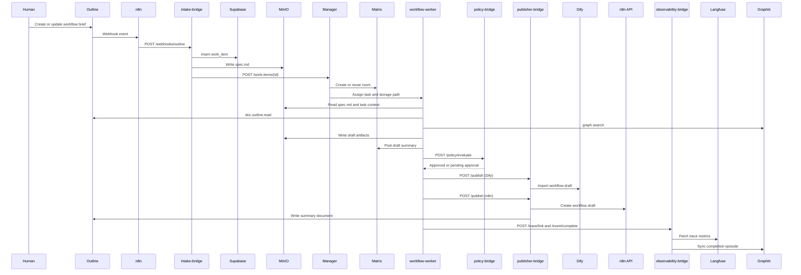

# Outline Brief to Workflow Draft — Automated Authoring Loop

This workflow shows the full closed loop that turns a human-authored Outline brief into published draft resources in Dify and n8n, with Matrix visibility, MinIO-backed task state, policy checks, and observability hooks.

## Overview

- **What this workflow does:** converts an Outline workflow brief into a normalized `workflow.author` work item, drafts workflow definitions, publishes non-production drafts, and writes a summary back to Outline.
- **Who triggers it:** a human author working in Outline, typically by creating or updating a document that clearly describes an automation or workflow task.
- **What comes out:** a Supabase work item, a `spec.md` in MinIO, a Matrix room thread, Dify and n8n draft JSON artifacts, published draft resources, an Outline summary document, and linked Langfuse/Graphiti observability records.

## Prerequisites

1. **Core services must be reachable.** You need Outline, n8n, `intake-bridge`, Supabase, MinIO, the HiClaw Manager, at least one `workflow-worker`, Matrix/Tuwunel, `policy-bridge`, `publisher-bridge`, `observability-bridge`, Langfuse, Graphiti, Dify, and the target n8n instance.
2. **MinIO must expose the HiClaw shared bucket.** In this repo, the S3 bucket is configured by `MINIO_HICLAW_BUCKET`, and the task data lives under the key prefix `hiclaw-storage/`. The effective task path for a work item is therefore `s3://$MINIO_HICLAW_BUCKET/hiclaw-storage/shared/tasks/task-{id}/`.
3. **The `workflow-worker` needs a Higress consumer.** Give it a dedicated consumer identity and token with access to the LLM routes and the MCP surfaces that back `doc.outline.read` and `graph.search`. Do not reuse a generic human token.
4. **Bridge-to-bridge calls need the worker bearer secret.** The policy, publisher, and observability bridges in this repo authenticate with the bearer token stored in `WORKER_JWT_SECRET`. This is separate from the Higress consumer token used for worker tool access.
5. **The Outline webhook path must preserve the signed body.** The intake bridge validates HMAC over the raw request body and accepts headers such as `X-Outline-Signature-256`.

## End-to-End Sequence



## Step-by-Step Walkthrough

### 1. Human writes a brief in Outline

1. Start with an Outline document whose title and body clearly indicate that the request is about a workflow. The current intake classifier looks for terms such as `workflow`, `automation`, `n8n`, `dify`, or `pipeline`.
2. Use section headers that the intake bridge can reliably normalize:
   - `## Objective`
   - `## Acceptance Criteria`
   - `## Context`
   - `## Notes`
3. Put the most important execution details in plain Markdown rather than screenshots or attachments. The intake bridge extracts `Objective` and `Acceptance Criteria` into first-class work-item fields and preserves everything else as source content.
4. A production-friendly brief usually includes these additional sections even though the bridge stores them inside source content rather than dedicated columns:
   - `## Trigger`
   - `## Inputs`
   - `## Outputs`
   - `## Target Systems`
   - `## Constraints`
   - `## Non-Production Guardrails`

Example Outline brief skeleton:

```markdown
## Objective
Draft a non-production workflow that turns a new product brief into a Dify and n8n workflow draft.

## Acceptance Criteria
- Produce a Dify workflow JSON draft.
- Produce an n8n workflow JSON draft.
- Keep all writes in draft or sandbox mode.
- Return a summary document with links to both draft resources.

## Context
Use the existing Outline product-brief collection and the automation design conventions already stored in Graphiti.

## Constraints
- Environment: non-production
- Publish mode: draft only
- Max cost: 3 USD
- Max duration: 1800 seconds
```

### 2. Outline webhook fires to n8n and then to `intake-bridge`

1. Outline emits a `documents.create` or `documents.update` event.
2. n8n receives the webhook, optionally enriches it, and forwards the signed payload to the intake bridge route `POST /webhooks/outline`.
3. The intake bridge validates the HMAC signature using the raw request body. In the current repo, the secret is derived from `WORKER_JWT_SECRET` through `Settings.webhook_secret`.
4. If the body is modified in transit, if the signature header is missing, or if the wrong shared secret is used, the request is rejected before any work item is created.

### 3. Intake bridge classifies the document as `workflow.author` and creates a work item in Supabase

1. `OutlineHandler` normalizes the payload into a `WorkItemCreate` object.
2. The intake bridge sets:
   - `source_type` to `outline_document`
   - `source_ref` to the document URL when available
   - `objective` from the `Objective` section or first paragraph
   - `acceptance_criteria` from the `Acceptance Criteria` section or checklist items
3. The classifier marks the item as `workflow.author` when the title or body contains workflow-related keywords.
4. The canonical work-item data is stored in Supabase as the system of record.
5. For this example, the task is assumed to be explicitly non-production and low risk. That matters because the policy bridge auto-approves `approval_policy=medium` only when `risk_level=low`.
6. One implementation detail to keep in mind: the design doc shows a nested `source` and `constraints` structure, while the current intake model persists the equivalent data as `source_type`, `source_ref`, and `constraints_json`.

### 4. `spec.md` is staged to MinIO under `hiclaw-storage/shared/tasks/task-{id}/`

1. After the work item is inserted, the intake bridge renders `spec.md` from the normalized work item.
2. The object key is `hiclaw-storage/shared/tasks/task-{id}/spec.md` inside the bucket configured by `MINIO_HICLAW_BUCKET`.
3. The rendered spec includes:
   - title
   - objective
   - acceptance criteria
   - context metadata such as workspace, source, priority, risk, and approval policy
   - the original document text under `## Source Content`
4. This gives the worker a stable, reproducible input even if the original Outline document changes later.

### 5. The Manager is notified through `POST /work-items/{id}`

1. In parallel with MinIO staging, the intake bridge sends the stored work item JSON to the Manager endpoint `POST /work-items/{id}`.
2. The Manager should treat the work item as the authoritative execution contract and use the MinIO task directory as the shared state root.
3. If storage succeeds but manager notification fails, the intake bridge returns a partial-success response and the task should be retried from the manager side.

### 6. The Manager reads the work item, selects a `workflow-worker`, and creates a Matrix room

1. The Manager decides whether to reuse a warm `workflow-worker` or launch a new one.
2. It creates or reuses a Matrix room for the task and adds the relevant human observers.
3. It associates the task with the worker identity, Matrix room id, and the worker’s Higress consumer identity.
4. It can also write additional task metadata such as `meta.json`, source links, and publication intent into the same MinIO task directory.

### 7. The `workflow-worker` pulls the spec from MinIO and uses `doc.outline.read` and `graph.search`

1. The worker starts from `spec.md`, not from ad hoc chat context.
2. `doc.outline.read` is used to pull the latest Outline document, nearby pages, or linked design references.
3. `graph.search` is used to retrieve prior workflow conventions, integration constraints, and any earlier episodes related to the same business process.
4. The worker combines three layers of context:
   - the normalized work item
   - the rendered MinIO spec
   - external context from Outline and Graphiti

### 8. The worker drafts Dify workflow JSON and n8n workflow JSON and stores both under `artifacts/`

1. The worker generates a Dify-compatible JSON draft and an n8n-compatible JSON draft.
2. A typical artifact layout is:

```text
s3://$MINIO_HICLAW_BUCKET/hiclaw-storage/shared/tasks/task-{id}/
  spec.md
  result.md
  artifacts/
    dify-workflow.json
    n8n-workflow.json
    draft-summary.md
```

3. Keeping both definitions in the same task directory makes publication idempotent and reviewable.
4. `result.md` should summarize the design decisions, unresolved assumptions, and any manual follow-up needed before a production promotion.

### 9. The worker posts a draft summary in the Matrix room

1. The Matrix summary should link to the MinIO artifacts, not paste the entire JSON into the room.
2. A good update includes:
   - what the workflow now does
   - which acceptance criteria are covered
   - what still needs review
   - where the draft artifacts are stored
3. This room update is the human-visible checkpoint before publication.

### 10. The policy bridge evaluates the task and auto-approves low-risk non-production publication

1. The worker or Manager calls `POST /policy/evaluate` with the work item id, kind, requester, risk, approval policy, room id, and estimated cost.
2. In this example, `approval_policy=medium` and `risk_level=low`, so the current policy bridge auto-approves the task.
3. If the same workflow targeted production systems or had `risk_level=medium` or above, the policy bridge would create an approval record and notify the Matrix room instead.
4. If your API gateway exposes a shorter path such as `POST /approve`, treat that as a deployment alias. The service route in this repo is `POST /policy/approve` for explicit human decisions.

### 11. The publisher bridge imports the Dify and n8n drafts

1. Publication is usually done as two separate `POST /publish` calls:
   - one with `target: "dify"`
   - one with `target: "n8n"`
2. The Dify publisher reads the selected JSON artifact from MinIO and sends it to Dify’s workflow import endpoint. In this repo the default path is `POST /v1/workflows/import`; some deployments proxy that as `/api/workflows/import`.
3. The n8n publisher reads the n8n artifact and sends it to `POST /api/v1/workflows` by default.
4. The publisher bridge records returned identifiers such as `dify_workflow_id` and `n8n_workflow_id` into Supabase `external_refs`.
5. Because publisher requests are idempotent at the target-ref layer, a second publish call is skipped once the external ref already exists.

### 12. The publisher writes a summary document back to Outline

1. After both targets are published, the bridge writes a human-readable summary back into Outline.
2. That document should include:
   - the originating work item id
   - the source Outline document link
   - Dify draft link or id
   - n8n draft link or id
   - known limitations or production follow-ups
3. The Outline publisher uses `POST /api/documents.create` or `POST /api/documents.update` under the hood, depending on whether you are creating a new summary page or updating the original brief.

### 13. The task is marked complete and observability links the Langfuse trace and Graphiti episode

1. The worker links its trace through `POST /trace/link` when a Langfuse trace id is known.
2. On completion it sends `POST /event/complete` with `sync_graphiti: true`.
3. The observability bridge updates the `task_runs` row, syncs Langfuse metrics, and calls Graphiti with the final summary and metadata.
4. The result is a fully attributable execution record keyed by work item id, task run id, Matrix room id, worker id, and published external refs.

## Example Work Item JSON

The design doc’s canonical shape for this workflow looks like this. In the current intake-bridge implementation, `source.type/ref` maps to `source_type/source_ref` and `constraints` maps to `constraints_json`.

```json
{
  "id": "wi_9b5d56bb7ed24e53a948ed3c6586f88e",
  "workspace_id": "product-automation",
  "kind": "workflow.author",
  "source": {
    "type": "outline_document",
    "ref": "https://outline.example.com/doc/outline-to-workflow-draft"
  },
  "objective": "Draft a non-production workflow that turns a new Outline brief into Dify and n8n workflow drafts.",
  "acceptance_criteria": [
    "Produce a Dify workflow JSON draft.",
    "Produce an n8n workflow JSON draft.",
    "Keep all writes in draft or sandbox mode.",
    "Write a summary page back to Outline with links to both drafts."
  ],
  "constraints": {
    "outline_doc_id": "doc_7F2M4R",
    "source_event": "documents.update",
    "target_platforms": [
      "dify",
      "n8n"
    ],
    "publish_mode": "draft",
    "environment": "non-production",
    "max_cost_usd": 3.0,
    "max_duration_sec": 1800
  },
  "risk_level": "low",
  "approval_policy": "medium",
  "requested_by": "maya.automation@example.com"
}
```

## Troubleshooting

### If the workflow draft is not published

1. Check that the work item reached MinIO and that both JSON artifacts exist under `artifacts/`.
2. Check the policy decision. A `workflow.author` item with `risk_level=medium` is not auto-approved when `approval_policy=medium`.
3. Check the publisher target metadata and make sure the artifact URIs use `s3://` paths.
4. Check whether the publish was skipped because `external_refs` already contains `dify_workflow_id` or `n8n_workflow_id`.
5. Check whether your Dify deployment expects `POST /v1/workflows/import` or a proxy alias such as `/api/workflows/import`.

### If the Matrix room is not created

1. Check whether the intake bridge returned a partial success where `processing.manager.status` is `error`.
2. Check Manager health and whether it is actually handling `POST /work-items/{id}`.
3. Check the Manager’s Matrix access configuration and whether it can create rooms on the configured homeserver.
4. Check whether the task was intentionally routed into an existing room and only the room-ref write failed.

### If Higress rejects the `workflow-worker` token

1. Check that the request is using the worker’s Higress consumer token, not `WORKER_JWT_SECRET`.
2. Check that the consumer is attached to the correct routes for LLM access and the MCP services behind `doc.outline.read` and `graph.search`.
3. Check the `Authorization` header format expected by your Higress route policy.
4. Check rate limits, route ACLs, and whether the worker identity was rotated without updating the runtime config in `hiclaw-storage/agents/workflow-worker/`.
