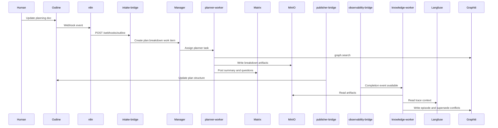

# Planning and Documentation Workflows — Planner and Knowledge Workers

These workflows cover the planning side of ClawCluster: turning Outline planning changes into structured task breakdowns, feeding completed work back into Graphiti, and running a nightly planning cycle that prepares the team for the next day.

## Shared Prerequisites

1. Outline, Supabase, MinIO, the HiClaw Manager, `planner-worker`, `knowledge-worker`, Matrix, `publisher-bridge`, `observability-bridge`, Graphiti, Langfuse, and n8n scheduling must all be available.
2. The shared task bucket must exist at `s3://$MINIO_HICLAW_BUCKET/hiclaw-storage/shared/tasks/`.
3. `planner-worker` needs Higress access to the LLM routes plus the skills behind `plan.breakdown`, `doc.outline.read`, and `graph.search`.
4. `knowledge-worker` needs the Graphiti sync surface plus access to MinIO artifacts, Matrix summaries, and trace metadata.

## Planning and Knowledge Loop



## Section A — Plan Breakdown Workflow

### 1. Trigger: a human updates a project planning doc in Outline

1. The best trigger documents contain planning terms such as `breakdown`, `roadmap`, `milestone`, `plan`, or `decompose`, because those keywords push the intake classifier toward `plan.breakdown`.
2. A good planning doc usually includes:
   - `## Objective`
   - `## Milestones`
   - `## Constraints`
   - `## Dependencies`
   - `## Open Questions`
3. The more explicit the milestones and dependencies are in Outline, the less rework the planner has to do later.

### 2. Intake creates a `plan.breakdown` work item

1. n8n forwards the Outline event to `POST /webhooks/outline`.
2. The intake bridge normalizes the content into a work item and persists it in Supabase.
3. As with every other work item type, it stages `spec.md` under `hiclaw-storage/shared/tasks/task-{id}/spec.md`.
4. The Manager is notified so the task can be assigned immediately or picked up by a warm planner worker.

### 3. `planner-worker` uses `plan.breakdown` and queries Graphiti for project context

1. The worker reads `spec.md` and the source Outline document.
2. It then uses `graph.search` to pull project history, prior milestone decisions, ADR summaries, recent blockers, and ownership context.
3. This is where planning gets better over time: the worker is not just decomposing the current doc, it is decomposing it in the context of what the project has already learned.

### 4. The planner produces a task breakdown list, dependency graph, and ADR draft

1. The output bundle should be written back to MinIO, for example:

```text
s3://$MINIO_HICLAW_BUCKET/hiclaw-storage/shared/tasks/task-{id}/artifacts/
  breakdown.md
  dependency-graph.mmd
  adr-draft.md
  planner-summary.md
```

2. `breakdown.md` should convert the plan into clear work packages with owners, expected outputs, and sequencing hints.
3. `dependency-graph.mmd` can be Mermaid text or another graph artifact that downstream tools can render.
4. `adr-draft.md` should capture the decision that the planner thinks the team is implicitly making, along with trade-offs and open questions.
5. The worker posts a concise summary and any blocking questions into the Matrix room.

### 5. Publisher writes the updated plan structure back to Outline

1. Once the planner output is accepted for publication, `publisher-bridge` writes the new plan structure into Outline.
2. Teams usually choose one of two patterns:
   - update the original planning page with a new breakdown section
   - create child documents for milestones, tasks, or ADR drafts
3. The important part is that Outline remains the primary human-facing planning surface.

### 6. Human reviews the breakdown in Outline and corrections create a new work item

1. Humans review structure, priority, and dependency quality in Outline rather than trying to keep the canonical plan in Matrix.
2. If the human corrects the breakdown, that update becomes a fresh planning event and creates a new work item.
3. This keeps the loop explicit: planning is iterative, but each iteration still has traceable inputs and outputs.

## Section B — Knowledge Sync Workflow

### 1. Trigger: task completion event from `observability-bridge`

1. When a task run ends, the worker or Manager sends `POST /event/complete`.
2. The payload includes the `task_run_id`, `work_item_id`, final status, optional `trace_id`, summary text, and sync metadata.
3. This is the low-level completion signal that starts durable knowledge capture.

Example completion event:

```json
{
  "task_run_id": "8d15fc4e-b4b6-4f43-94fe-bf6f3a66f4b3",
  "work_item_id": "wi_2b8e7f2e6f8d4692a2db5db83012a0f7",
  "status": "succeeded",
  "trace_id": "trace_01JY2QX8MY7YB1Q5X2FW0M7P8A",
  "result_summary": "Published MR for publisher status endpoint and attached validation evidence.",
  "sync_graphiti": true,
  "metadata": {
    "workspace_id": "echothink/echothink-clawcluster",
    "matrix_room_id": "!opsroom:example.com",
    "agent_ids": [
      "manager-main",
      "coding-worker-3",
      "qa-worker-2"
    ],
    "sprint": "2026-W11"
  }
}
```

### 2. `knowledge-worker` activates on the `graph.sync_episode` skill

1. The immediate bridge-level sync can store a minimal completion fact.
2. The `knowledge-worker` then enriches that with the `graph.sync_episode` skill so the final episode contains durable project knowledge rather than only operational status.
3. Treat the bridge event as the trigger and the knowledge-worker as the enrichment layer.

### 3. The worker reads completed task artifacts, Matrix summary, and Langfuse trace

1. MinIO provides the durable artifact bundle.
2. Matrix provides the human-visible narrative: approvals, blockers, pivots, and final summary language.
3. Langfuse provides cost, token, and prompt-trace context when a trace id is present.
4. Together these sources tell the worker not only what was built, but how the decision evolved.

### 4. The worker extracts entities and relationships

1. It identifies concrete entities such as services, endpoints, documents, workflows, repositories, branches, and MR ids.
2. It extracts relationship facts such as:
   - which change implemented which objective
   - which ADR influenced the change
   - which tests validated it
   - which dependencies or risks were discovered
3. This step is what turns raw artifacts into queryable memory.

### 5. The worker writes a Graphiti episode with temporal context

1. Every episode should carry enough time context to be useful later:
   - project version or branch
   - sprint or planning cycle
   - work item id
   - task run id
   - involved agent ids
   - room id when relevant
2. Temporal context matters because the same subsystem can be redesigned multiple times. Future workers need to know which fact was true when.

### 6. The worker marks conflicting graph nodes as superseded

1. Planning and coding produce many facts that later become stale.
2. The knowledge-worker should mark older conflicting nodes or relationships as superseded rather than silently overwriting them.
3. This preserves auditability while still keeping current knowledge easy to retrieve.

### 7. Why this matters

1. Future tasks start with better context.
2. The next `coding-worker` can retrieve prior decisions directly from Graphiti instead of reconstructing them from chat history.
3. The next `planner-worker` can see which milestones were blocked, which assumptions failed, and which decisions were already approved.

## Section C — Overnight Planning Cycle

### 1. A scheduled planner run starts nightly at 2 AM through n8n

1. n8n runs a cron-triggered planning workflow at 2 AM.
2. The workflow scans open work items, waiting approvals, blocked tasks, and recent completions.
3. This scheduled run should create a dedicated planning task or a planner batch job rather than trying to do ad hoc background work without traceability.

### 2. `planner-worker` scans open work items, checks for stalled tasks, and generates a morning briefing

1. The planner identifies tasks that have not updated recently, tasks with repeated validation failures, and tasks waiting on human input.
2. It groups them into a morning briefing with sections such as:
   - urgent blockers
   - approvals needed
   - tasks ready for publication
   - tasks likely to miss schedule
3. It can also recommend plan reshaping, such as splitting oversized work items.

### 3. The briefing is posted to Matrix and written to the Outline daily standup doc

1. Matrix gets the live operational version for people starting work.
2. Outline gets the durable written record for the daily standup or status collection.
3. This dual write keeps the room useful for immediacy and Outline useful for durable team coordination.

### 4. `knowledge-worker` runs a consistency check across recent Graphiti episodes

1. After the nightly planner output, the knowledge-worker checks recent Graphiti episodes for contradictions, missing links, or stale ownership data.
2. If it finds conflicts, it flags them for human review or writes a small follow-up knowledge task.
3. This keeps the planning loop and the knowledge graph aligned instead of drifting apart over time.

## Troubleshooting

### If the plan breakdown looks shallow or generic

1. Check the original Outline doc for concrete milestones, dependencies, and constraints.
2. Check whether the planner worker had access to Graphiti context or ran without project memory.
3. Check whether the intake classifier routed the document to `plan.support` instead of `plan.breakdown`.

### If knowledge sync is missing important facts

1. Check whether `POST /event/complete` included a useful `result_summary` and metadata payload.
2. Check whether the artifact bundle in MinIO actually contains the planner, coding, or QA outputs the knowledge-worker expects.
3. Check whether the trace id was linked so Langfuse context was available for enrichment.

### If the overnight briefing does not appear

1. Check the n8n cron schedule and execution history for the 2 AM planner run.
2. Check whether the planner batch created a task room but failed before writing the Matrix or Outline summary.
3. Check whether Outline publication succeeded and whether the target standup document id or collection id is still valid.
